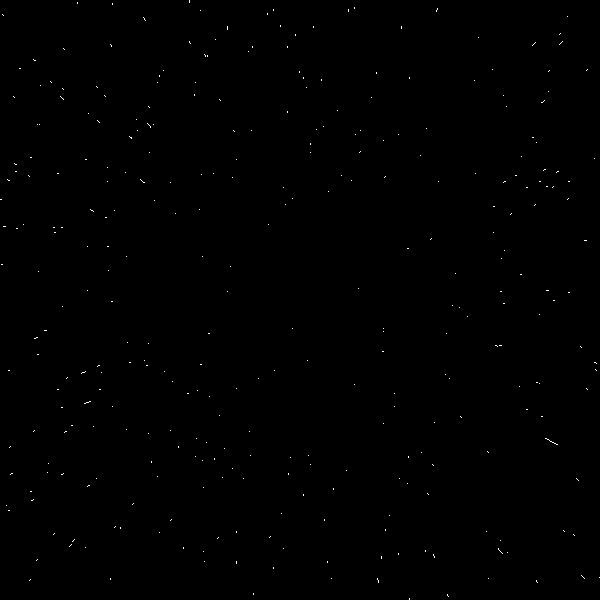

# Starfield
## [Coding Challenge](https://www.youtube.com/watch?v=17WoOqgXsRM&list=PLRqwX-V7Uu6ZiZxtDDRCi6uhfTH4FilpH&index=1)

This is a pretty simple effect - a large number of stars are placed throughout the screen randomly. These 'stars' are nothing more than simple lines that draw from their previous position to their current position. These stars travel from near the center of the scene, and accelerate outwards. Once they are well off screen, they teleport to their 'far away' position and this cycle repeats.

There are a few improvements and theoretical bugs to be worked on - if your computer ran at a high enough framerate then you wouldn't see any trails. Plus, the trajectory isn't a perfect 'starfield', it just happens to look close enough for our purposes.

# Example

