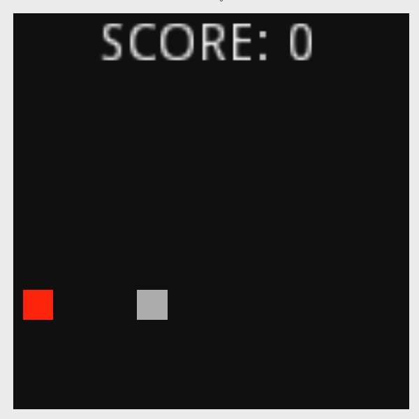

# Snake Game
## [Coding Challenge](https://www.youtube.com/watch?v=AaGK-fj-BAM)

The [Snake Game](https://en.wikipedia.org/wiki/Snake_(video_game_genre)) is a classic arcade game that I'm sure you're already aware of. It involves the player controlling a snake who attempts to get score by eating apples on the game board. As the player eats apples, they gain points but also get longer, and the player will lose the game if they eat themselves or fall off the boundaries of the map.

The game continues until the player fails, or until there is no remaining locations on the board for new apples (meaning the player is now filling the board entirely!) The game is then scored and the player may play again.

# Playing the Game
The game is played with the WASD keys or the arrow keys. You may restart with R.

# Implementation
The game is implemented with a few primary components:
- Controlling the snake
- Spawning apples
- Eating apples or the player

## Controlling the snake
The snake is controlled by polling player input and picking the correct direction. Then, on each game tick, the snake is advanced in that direction. Any tail segments also follow the snake's head. If the player hits multiple inputs in the same game tick, the latest input dictates which of the cardinal directions to move. Only the 'head' section respects player input, the remaining segments are simply following the head.

## Spawning apples
Spawning an apple is a relatively task. Collecting all of the valid board locations involves getting every space and removing the spaces that the player currently occupies. Then, one of the remaining locations is selected at random. An apple object is then spawned at that location.

## Eating apples or the player
The apples and the players are `Area2D` nodes, which means that they will detect collisions via `CollisionShape2D` nodes, but are otherwise outside of the physics engine. We want to ignore the physics engine, as it will try to control the player's location and respond to forces such as gravity. The snake's 'head' segment then responds to `area_entered` signals, and the script determines whether an apple was hit or another segment. The snake them emits it's own signal for the `Game` node to respond to. If it was an apple, score is increased, another segment is added, and the game tick speed is increased!

# Example
