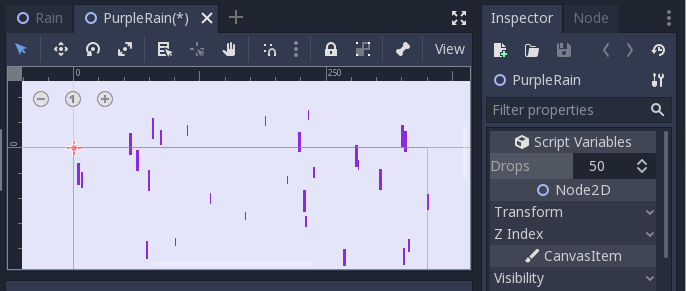

# Purple Rain
## [Coding Challenge](https://www.youtube.com/watch?v=KkyIDI6rQJI)

Purple Rain is a very simple animation where purple raindrops fall down from above the screen. Although there is not much going on, it can still be quite pleasing to look at.

You'll notice when running the scene that they initially fall down in 'waves'. This is because all of the droplets spawn at the same time above the screen, and therefore the window is blank to begin. However, after a few iterations the view becomes flooded with a steady stream of purple rain. This is part of the effect of gravity and how we treat droplets that are further away, which is explained in more detail below.

# Implementation
There are only a few components to this project - the droplet (which knows how to move itself and render) and the main scene, which simply creates a collection of droplets.

## Droplets
Droplets can be placed in the world with a position and distance, which are then used to compute things like the scale at which to draw and how much gravity should have an effect. Droplets that are 'further away' are smaller, and also move slower in response to gravity giving a parralax effect. Once a droplet leaves the bottom of the screen, it returns back to it's original position, resets velocity, and the cycle continues

## Main Scene
This scene is really just a glorified list of purple rain drops. The user can specify how many droplets (usually hundreds!) they wish to simulate with and the scene builds these droplets and places them at random positions and distances in the scene.

## Tool Mode
Due to the simplicity of this challenge, I opted to include [tool mode](https://docs.godotengine.org/en/latest/getting_started/scripting/gdscript/gdscript_basics.html#tool-mode). This means that, without running the actual project, you can get immediate feedback on changes made to the `export` attributes on the Rain objects and the main scene. By utilizing [setget](https://docs.godotengine.org/en/3.1/getting_started/scripting/gdscript/gdscript_basics.html#setters-getters) we can refresh/reset properties of the drops when they are modified by either the Editor window or other classes. Just remember to also reset the objects in their `_ready()` functions in the case where they aren't modified from an external object.

You can take advantage of this tool mode in both scenes - either by changing the droplet count in the `PurpleRain` scene or actually experimenting with a single droplet to see how distance and position affect how it looks.

# Example

